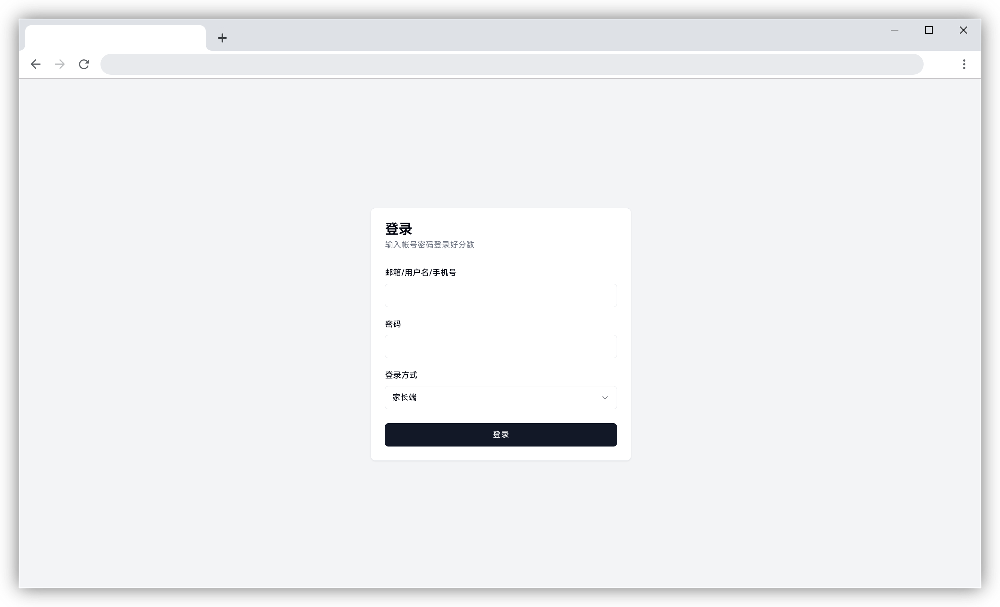
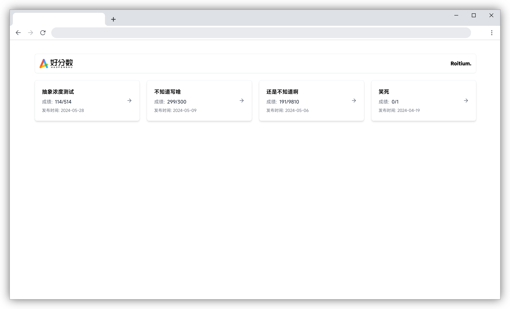
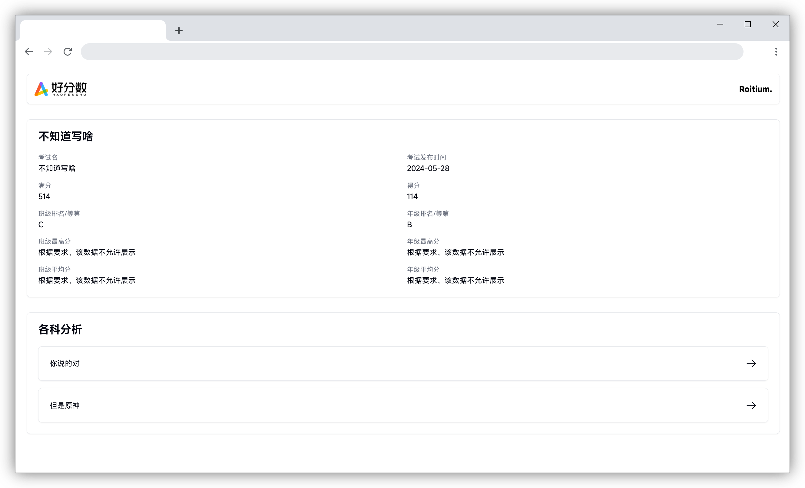

<h2 align="center">✨HFS NEXT✨</h2>
<h5 align="center">你的下一个好分数，何必是好分数？</h5>
<h5 align="center">网址： <a href="https://hfs.uselesslab.top" target="_blank">hfs.uselesslab.top</a></h5>

# 简介
厌倦了包含着摇一摇开屏广告和各种vip提示的hfs？或许你可以试试这个~ \
基于好分数api重新开发的前端ui，耳目一新（或许？）  \
更有一些小特性，增强使用体验（看你能不能找到了）

# TODO
- [x] 登录页
- [x] 试卷选择页
- [x] 试卷详情页

# 隐私声明
由于CORS限制，您输入的用户名密码会先传输到vercel服务器，再向hfs api发送请求，全过程不会以**任何方式**（包括但不限于日志、文件等方式）持久化存储您的数据。并且代码全部开源，您可以自行审查安全性。如果还是不信任的话我劝你还是不要用了，反正该请求什么api都在@/app/actions.tsx里写的很清楚了，自己玩去吧

# 截图（不是最新的，建议直接登录体验）
### 登录页

### 试卷列表页

### 试卷详情页

# 感谢
[v0.dev](https://v0.dev) 大部分组件都由v0dev生成，我就是个套模板的